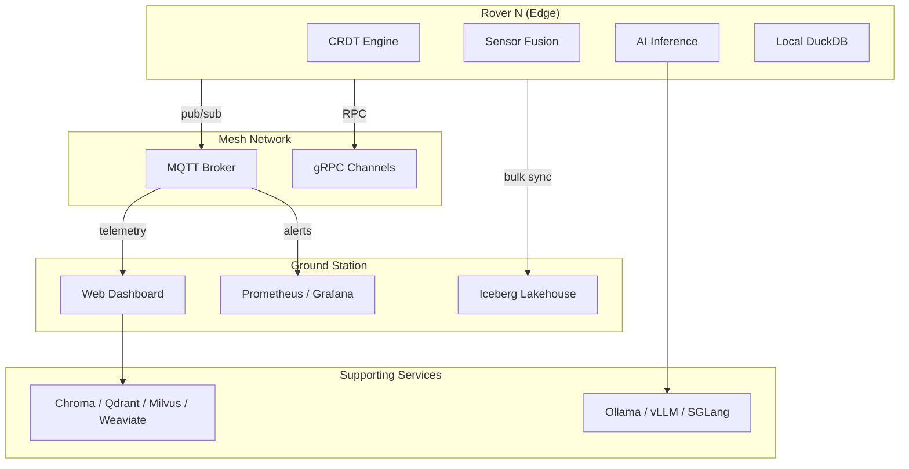
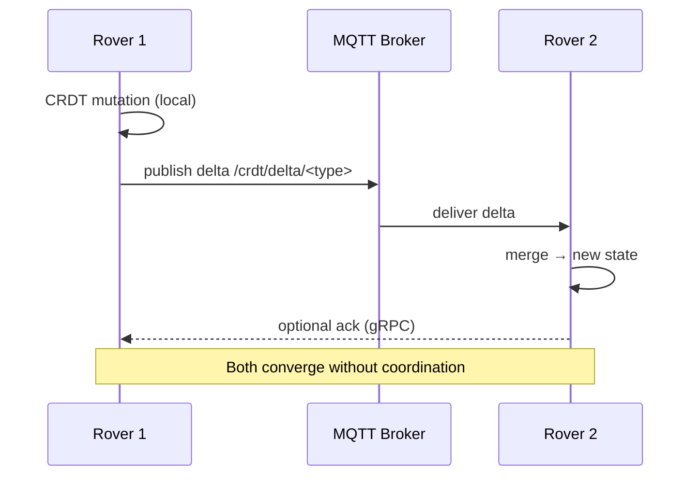
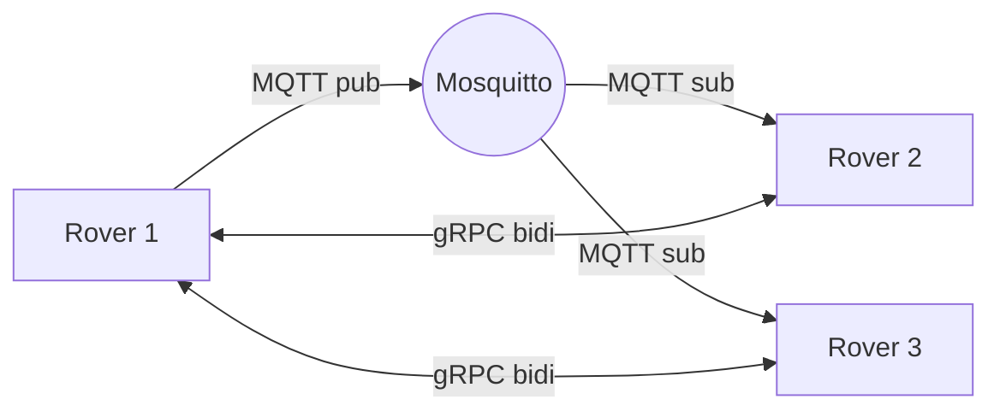
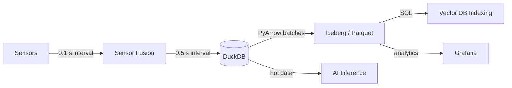
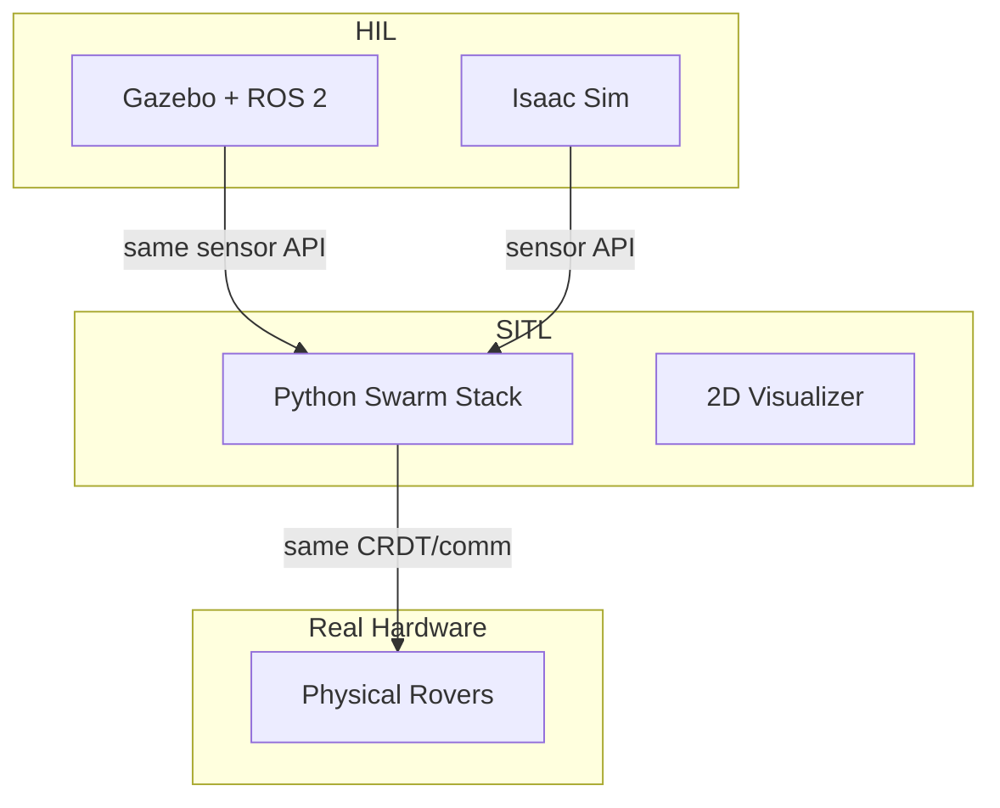
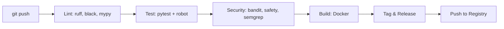

# Architecture — Autonomous Rover Swarm Coordination

## 1. System Overview

This platform enables a decentralized swarm of autonomous rovers to coordinate in GPS-denied, communication-hostile environments. Every stateful component is built as a **Conflict-free Replicated Data Type (CRDT)**, ensuring that each rover converges to the same system state without requiring a central coordinator or continuous connectivity.

The system is organized into five logical tiers:

| Tier | Responsibility |
|------|---------------|
| **Edge** | Each rover runs the full stack — CRDT engine, sensor fusion, AI inference, local persistence |
| **Mesh** | Peer-to-peer communication via MQTT (pub/sub telemetry) and gRPC (RPC for sync & commands) |
| **Ground** | Ground station dashboard, persistence pipeline (DuckDB → Iceberg), observability |
| **Serving** | FastAPI web dashboard, vector DB services, model inference servers |
| **Simulation** | SITL (software-in-the-loop) and HIL (hardware-in-the-loop) with Gazebo / Isaac Sim |



## 2. CRDT-Based State Management

Every rover hosts a full replica of the swarm state. State mutations are represented as **deltas** and propagated via MQTT or gRPC. On receipt, each peer merges the delta using a **semi-lattice merge function**.

### Design Rationale

- **No single point of failure**: No leader, no Raft/Paxos coordinator.
- **Partition tolerance**: Rovers disconnected from the mesh re-converge when connectivity returns — CRDTs guarantee eventual consistency without rollbacks.
- **Peer-to-peer sync**: Full sync every 60 s, delta sync every 1 s, gossip fanout of 3.
- **Tombstone GC**: Deleted entries are tombstoned and cleaned up after 1 hour.

### CRDT Types

| Type | Data Structure | Merge Semantics |
|------|---------------|-----------------|
| `GCounter` | Increment-only counter | `max(L, R)` per replica |
| `PNCounter` | Pair of GCounter | Sum of positive & negative |
| `GSet` | Grow-only set | Union |
| `LWWRegister` | Timestamped value | Last-writer-wins (wall clock + replica ID tiebreak) |
| `MVRegister` | Multi-value register | Union of concurrent writes |
| `ORMap` | Observed-remove map | Add-wins semantics |
| `RWLWWMap` | Real-world LWW map | Per-key LWW |



## 3. Communication Architecture

Two complementary channels:

### MQTT (Pub/Sub)

- **Broker**: Eclipse Mosquitto 2.x, TLS 1.3, mutual TLS authentication.
- **Topics**: Hierarchical — `swarm/{mission}/{rover_id}/{type}`.
- **QoS**: Telemetry → QoS 1, CRDT sync → QoS 2, heartbeats → QoS 0.
- **Payload**: Serialized MessagePack (via `orjson` + `msgpack`).

```
Topic tree:
  swarm/
    {mission_id}/
      telemetry/{rover_id}     -- GPS, IMU, battery, status
      crdt/delta/{type}        -- CRDT mutation deltas
      crdt/full/{type}         -- Full state snapshots
      cmd/{target_id}          -- Command & control
      task/allocate            -- Task assignments
      consensus/{round}        -- Consensus messages
      alert/{severity}         -- Emergency alerts
      heartbeat/{rover_id}     -- Liveness
```

### gRPC (RPC)

- **Unary**: `RequestFullSync`, `RequestDelta`, `TaskStatus`, `ModelInfer`.
- **Server-streaming**: `SubscribeTelemetry`, `WatchTasks`.
- **Bidi-streaming**: `CrdtSyncStream` — continuous delta exchange.



## 4. Swarm Coordination Algorithms

### 4.1 Consensus (Raft-Inspired over CRDT)

Rovers elect a **leader** using randomized timeouts (2–5 s). The leader proposes tasks and formation waypoints. Because the underlying state is a CRDT, a leader crash only delays progress — no split-brain or log truncation.

```
Each rover R:
  loop:
    if election_timeout expired:
      become CANDIDATE
      request votes (MQTT broadcast)
      if majority (quorum = N/2 + 1):
        become LEADER
        start sending heartbeats every 1 s
    on heartbeat from leader:
      reset election timeout
      accept leader's proposed state
```

### 4.2 Task Allocation

Greedy auction-based allocation with CRDT conflict resolution:

1. Tasks enter a shared `ORMap<TaskId, Task>`.
2. Rovers bid on unassigned tasks via `PNCounter`-tracked capacity.
3. The leader assigns tasks; conflicts are resolved via LWW.
4. Task status transitions: `PENDING → ASSIGNED → IN_PROGRESS → COMPLETED | FAILED`.

### 4.3 Formation Control

- **Leader-follower**: Leader publishes trajectory; followers compute offset using local PID controllers.
- **Virtual structure**: Each rover maintains a desired position in a global coordinate frame; error is minimized via consensus on the frame origin.

```ascii
     BEFORE PARTITION              AFTER REJOIN
    R1 ── R2 ── R3           R1 ── R2 ── R3
         \                            \
         R4 ── R5                    R4 ── R5
    (triangular wedge)        (triangular wedge — same CRDT state)
```

## 5. Data Pipeline

Sensors → Local buffer → DuckDB (embedded OLAP) → Arrow IPC → Iceberg (lakehouse).



- **DuckDB** stores the last 24 h of telemetry locally on each rover.
- **Iceberg** is the ground-truth lakehouse on the ground station, built from Arrow IPC streams.
- **Polars** is used for in-memory analytics on batch queries.

## 6. Vector Database Abstraction Layer

A unified `VectorDB` interface supports pluggable backends:

```python
class VectorDB(ABC):
    @abstractmethod
    async def upsert(self, collection: str, vectors: list[tuple[str, list[float], dict]]) -> None: ...
    @abstractmethod
    async def search(self, collection: str, vector: list[float], top_k: int = 10) -> list[SearchResult]: ...
    @abstractmethod
    async def delete(self, collection: str, ids: list[str]) -> None: ...
```

| Backend | Status | Use Case |
|---------|--------|----------|
| **Chroma** | Default | Development, small-scale |
| **LanceDB** | Supported | Embedded, serverless (columnar) |
| **Milvus** | Supported | Large-scale production |
| **Qdrant** | Supported | High-availability, filtering |
| **Weaviate** | Supported | Graph-based, hybrid search |

The active backend is selected via `ROVER_SWARM__VECTOR_DB__ACTIVE_BACKEND` env var.

## 7. AI/ML Inference Adapter Layer

A pluggable `InferenceEngine` interface abstracts model serving:

```python
class InferenceEngine(ABC):
    @abstractmethod
    async def generate(self, prompt: str, **kwargs) -> str: ...
    @abstractmethod
    async def embed(self, texts: list[str]) -> list[list[float]]: ...
```

| Engine | Python Binding | Use Case |
|--------|---------------|----------|
| **Ollama** | `ollama` | Local models, fast prototyping |
| **llama.cpp** | `llama-cpp-python` | Edge deployment (GGUF) |
| **vLLM** | `openai` client | High-throughput, GPU cluster |
| **SGLang** | `sglang` | Structured generation, guided decoding |

Models run externally in dedicated containers or on-device (llama.cpp). The adapter handles health checks, timeouts (30 s), and a local LRU cache (5 models).

## 8. Security Architecture

### 8.1 Transport Security

- **mTLS** everywhere: MQTT (8883), gRPC (50051), HTTP (8443).
- Certificate rotation via `gen_certs.sh` (OpenSSL + CA hierarchy).
- Curve25519 for key exchange, AES-256-GCM for payload encryption.

### 8.2 Authentication & Authorization

- **RBAC** with three roles: `operator` (full), `viewer` (read-only), `maintainer` (system config).
- JWT tokens (HS256, 30 min expiry) for the REST API.
- Per-topic ACLs on Mosquitto for MQTT (`swarm/{mission}/{rover_id}/#`).

### 8.3 OWASP Top 10 Mitigations

| Risk | Mitigation |
|------|-----------|
| Injection | Pydantic validation, parameterized queries |
| XSS | CSP headers, Vue.js auto-escaping |
| Broken Auth | mTLS + JWT short expiry |
| SSRF | URL allowlist in Uvicorn |
| Rate Limiting | Token bucket per IP (60 req/min) |
| Logging | Loguru with PII redaction |

## 9. Observability

### 9.1 Distributed Tracing (OpenTelemetry)

- Auto-instrumentation via `opentelemetry-instrument`.
- Traces exported via OTLP to a collector (e.g., Jaeger or Grafana Tempo).
- Spans: MQTT publish/receive, gRPC calls, CRDT merge, sensor read, inference request.

### 9.2 Metrics (Prometheus)

```
rover_info{node_id, role, version}
rover_battery_level{node_id}
rover_crdt_merge_duration_seconds{type}
rover_mqtt_messages_received_total{topic}
rover_task_processed_total{task_type, status}
```

### 9.3 ML Observability (W&B Weave)

- Prompts, completions, and model metadata logged to Weave.
- Trace links between inference calls and downstream decisions (e.g., task allocation).

## 10. Simulation Tier

### 10.1 SITL (Software-in-the-Loop)

- Runs the full Python stack without hardware.
- Uses `pygame` or `matplotlib` for 2D visualization.
- Supports network partition injection, sensor noise simulation.

### 10.2 HIL (Hardware-in-the-Loop)

- **Gazebo** with ROS 2 bridge for physics-accurate simulation.
- **Isaac Sim** (NVIDIA) for high-fidelity sensor rendering (LIDAR, camera).
- The same `SensorDriver` abstraction works in simulation and on real hardware.



## 11. Web Dashboard

- **Backend**: FastAPI (async, auto-generated OpenAPI docs).
- **Frontend**: Vue.js 3 with Leaflet for map visualization.
- **Real-time**: WebSocket for telemetry streaming, MQTT-over-WS for direct broker access.
- **Endpoints**:

| Method | Path | Purpose |
|--------|------|---------|
| `GET` | `/api/v1/rover` | List rovers |
| `GET` | `/api/v1/rover/{id}` | Rover detail + telemetry |
| `GET` | `/api/v1/mission/{id}` | Mission state |
| `GET` | `/api/v1/task` | Task board |
| `POST` | `/api/v1/task` | Create task |
| `WS`  | `/ws/telemetry` | Real-time telemetry stream |
| `WS`  | `/ws/crdt` | CRDT state diff stream |

## 12. CI/CD Pipeline



| Stage | Tools | Fails On |
|-------|-------|----------|
| Lint | `ruff`, `black --check`, `mypy` | Any violation |
| Test | `pytest`, `robotframework` | Test failure, <80 % coverage |
| Security | `bandit`, `safety`, `pip-audit`, `semgrep` | Any finding |
| Build | `docker build` | Build failure |
| Release | `git tag`, `gh release` | Manual trigger |

## 13. Directory Structure

```
rover-swarm/
├── src/rover_swarm/
│   ├── __init__.py
│   ├── config.py              # Pydantic Settings
│   ├── constants.py            # System-wide constants
│   ├── types.py                # Core dataclasses & enums
│   ├── exceptions.py           # Exception hierarchy
│   ├── logging_config.py        # Loguru configuration
│   ├── crdt/                   # CRDT types & merge engine
│   ├── communication/          # MQTT, gRPC clients/servers
│   ├── swarm/                  # Consensus, task allocation, formations
│   ├── sensor/                 # Sensor drivers & fusion
│   ├── ai/                     # Inference engine adapters
│   ├── api/                    # FastAPI web app
│   ├── security/               # TLS, auth, rate limiter
│   ├── simulation/             # SITL & HIL adapters
│   └── observability/          # OpenTelemetry, Prometheus, Weave
├── tests/
├── scripts/                    # bootstrap, gen_certs, clean
├── ci/                         # Mosquitto, Prometheus configs
├── docs/
│   └── ARCHITECTURE.md
├── docker-compose.yml
├── Dockerfile
├── pyproject.toml
├── Makefile
└── VERSION
```

## 14. Data Flow Diagrams

### 14.1 CRDT Sync Flow

```ascii
  Rover A                     MQTT Broker                   Rover B
    |                             |                            |
    |--- delta(t_1, ops) -------->|                            |
    |                             |--- delta(t_1, ops) ------->|
    |                             |                            |
    |                             |                            |--- merge delta
    |                             |                            |
    |                             |<--- delta(t_2, ops) -------|
    |<--- delta(t_2, ops) --------|                            |
    |                             |                            |
    |--- ack + full state ------->|                            |
    |                             |--- ack + full state ------>|
```

### 14.2 Sensor → Lakehouse Pipeline

```ascii
  ┌─────────┐  0.1s   ┌──────────────┐  0.5s   ┌───────────┐
  │ GPS/IMU │ ──────▶ │ SensorFusion │ ──────▶ │  DuckDB   │
  │ LiDAR   │         │ (position,   │         │ (last 24h)│
  │ Camera  │         │  orientation)│         └─────┬─────┘
  └─────────┘         └──────────────┘               │
                                                      │ Arrow IPC
                                                      ▼
                                               ┌───────────┐
                                               │  Iceberg   │
                                               │ (Lakehouse)│
                                               └───────────┘
```

### 14.3 Task Lifecycle

```ascii
  Operator          Leader Rover        Worker Rover
     │                  │                    │
     │ POST /task       │                    │
     │─────────────────▶│                    │
     │                  │ ORMap.insert(task) │
     │                  │────────────────────│
     │                  │                    │
     │                  │ assign(task_id)    │
     │                  │────────────────────│
     │                  │                    │
     │                  │           ┌────────┴────────┐
     │                  │           │ execute & update│
     │                  │           │ LWWRegister     │
     │                  │           └────────┬────────┘
     │                  │                    │
     │                  │ task.completed     │
     │                  │◄───────────────────│
     │                  │                    │
     │ GET status       │                    │
     │◄─────────────────│                    │
```

## 15. Key Design Decisions and Trade-offs

| Decision | Rationale | Trade-off |
|----------|-----------|-----------|
| **CRDT over Raft** | No leader, no split-brain, works in partitioned networks | Higher storage cost (tombstones); eventual consistency (seconds) |
| **MQTT + gRPC dual transport** | MQTT for fan-out telemetry, gRPC for low-latency RPC and streaming | Two stacks to maintain; need sync across transports |
| **Full stack on every rover** | No dependency on ground station for survival | Limited compute on edge; need model quantization (GGUF) |
| **DuckDB + Iceberg** | DuckDB for hot local data, Iceberg for ground truth lakehouse | Two query engines; Iceberg GC complexity |
| **Pluggable vector DB** | Avoid vendor lock-in; different perf profiles | Each backend has different consistency guarantees |
| **Pluggable AI engines** | Ollama for dev, vLLM for prod, llama.cpp for edge | Engine-specific tuning params leak through generic adapter |
| **mTLS everywhere** | Zero-trust mesh; every message authenticated | Certificate distribution in the field is operationally complex |
| **Python 3.12+ / strict mypy** | Type safety without Rust complexity | GIL limits concurrency; mitigated with async IO and multiprocessing |
| **Loguru over stdlib logging** | Structured logging, zero configuration, greppable output | Ecosystem integration requires InterceptHandler adapter |
